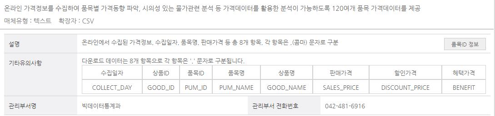

# data_contest

77ㅑ륵~~  
***
# 온라인 가격 정보 관련 데이터 :   
  
빅데이터활용->온라인 가격정보 클릭을 통해 볼 수 있다. 
　  
분류|품목|품목ID|
-----|----|------|
|농산물|	현미|A011020|
|농산물|풋고추|A011020|
|농산물|파프리카|A017260|
|농산물|토마토|A017200|
|농산물|키위|A016130|
|농산물|콩|A011050|
|농산물|찹쌀|A011030|
|농산물|참외|A016090|
|농산물|전복|A013090|
|농산물|아몬드|A016150|
|농산물|쌀|A011010|
|농산물|수박|A016100|
|농산물|생강|A019030|
|농산물|사과|A016010|
|농산물|블루베리|A016140|
|농산물|배|A016020|
|농산물|밤|A016050|
|농산물|미역|A01730|
|농산물|마른멸치|A013100|
|농산물|땅콩|A011060|
|농산물|딸기|A016110|
|농산물|낙지|A013120|
|농산물|김|A017280|
|농산물|고춧가루|A019010|
|농산물|고사리|A017250|
|농산물|고등어|A013040|
|농산물|고구마|A017120|
|
|가공식품|간장|A019050|
|고추장|A019080|
|가공식품|과일가공품|A016160
|가공식품|국수|A011090
|가공식품|기능성음료|A022040
|가공식품|김치|A019150
|가공식품|냉동식품|A019170
|가공식품|단무지|A017270
|가공식품|당면|A011110
|가공식품|된장|A019060
|가공식품|드레싱|A019110
|가공식품|라면|A011100
|가공식품|밀가루|A011080
|가공식품|북어채|A013140
|가공식품|분유|A014020
|가공식품|비스킷|A018050
|가공식품|빵|A011160
|가공식품|생선통조림|A013170
|가공식품|생수|A022030
|가공식품|설탕|A018080
|가공식품|소금|A019040
|가공식품|소시지|A012050
|가공식품|스낵과자|A018060
|가공식품|스프|A019130
|가공식품|식용유|A015020
|가공식품|식초|A019100
|가공식품|아이스크림|A018040
|가공식품|이유식|A019140
|가공식품|잼|A018090
|가공식품|즉석식품|A019180
|가공식품|차|A021020
|가공식품|참기름|A015010
|가공식품|치즈|A014030
|가공식품|카레|A019090
|가공식품|커피|A021010
|가공식품|탄산음료|A022050
|가공식품|파스타면|A011180
|가공식품|햄및베이컨|A012060
|가공식품|혼합음료|A022060
|가공식품|혼합조미료|A019120
|
|내구재|면도기|L012010
|내구재|전기레인지|E031040
|내구재|프린터|I012040
|내구재|헤어드라이어|L012020
|내구재|헬스기구|I021030
|
|섬유제품|남자내의|C011050
|섬유제품|남자상의|C011020
|섬유제품|남자외의|C011010
|섬유제품|남자하의|C011040
|섬유제품|등산복|C013060
|섬유제품|스웨터|C013030
|섬유제품|아동복|C014010
|섬유제품|여자내의|C012060
|섬유제품|여자상의|C012030
|섬유제품|여자외의|C012010
|섬유제품|여자하의|C012050
|섬유제품|운동복|C013050
|섬유제품|원피스|C012020
|섬유제품|유아복|C014020
|섬유제품|점퍼|C013010
|섬유제품|청바지|C013040
|섬유제품|티셔츠|C013020
|
|화장품|기초화장품|L012090
|화장품|모발염색약|L012120
|화장품|바디워시|L012070
|화장품|색조화장품|L012110
|화장품|샴푸|L012060
|기타공업제품|가정용비닐용품|E061070
|기타공업제품|공책|I053010
|기타공업제품|구강세정제|L012130
|기타공업제품|구두|C021020
|기타공업제품|방향제|E061090
|기타공업제품|보청기|F012060
|기타공업제품|복사용지|I053030
|기타공업제품|부엌용세제|E061040
|기타공업제품|살충제|E061060
|기타공업제품|섬유유연제|E061020
|기타공업제품|세탁세제|E061010
|기타공업제품|스케치북|I053020
|기타공업제품|습기제거제|E061100
|기타공업제품|실내화|C021040
|기타공업제품|아동화|C021010
|기타공업제품|운동화|C021030
|기타공업제품|전구|E061030
|기타공업제품|지갑|L021070
|기타공업제품|청소용세제|E061050
|기타공업제품|치약|L012040
|기타공업제품|칫솔|L012030
|기타공업제품|컴퓨터소모품|I012050
|기타공업제품|키친타월|E061080
|기타공업제품|필기구|I053050
|기타공업제품|화장지|L012080
|기타공업제품|회화용구|I053060